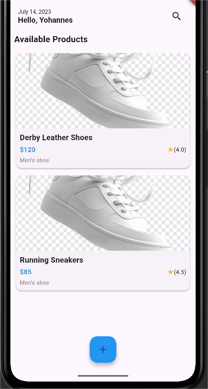
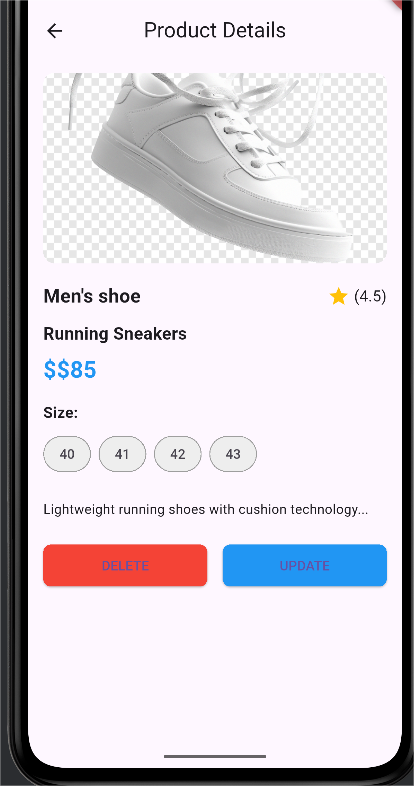
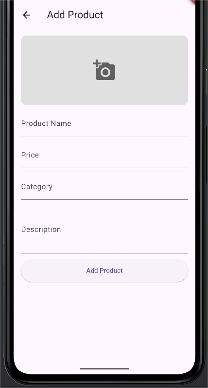
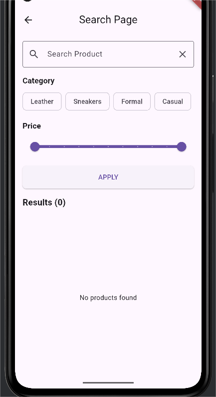

# Ecommerce Flutter App

A fully functional Flutter ecommerce app with user authentication (sign-in/sign-up), product listing, search, add/update/delete products, and detailed product views. Built using **Flutter**, **Bloc pattern**, and clean architecture principles.

---

## Features

- **User Authentication**
  - Sign Up (optional username)
  - Sign In
  - Persistent login with token storage

- **Product Management**
  - View product list with grid layout
  - Add new products (including image picker)
  - Update existing products
  - Delete products with confirmation dialog

- **Product Search and Filtering**
  - Search by product name
  - Filter by category and price range

- **Responsive UI**
  - Mobile-friendly and tablet-friendly layout

- **State Management**
  - Uses `flutter_bloc` for authentication and UI state

---

## Screenshots

   
 

## Getting Started

### Prerequisites

- Flutter SDK (>= 3.0.0)
- Dart SDK
- Android Studio or VS Code
- Device or emulator

